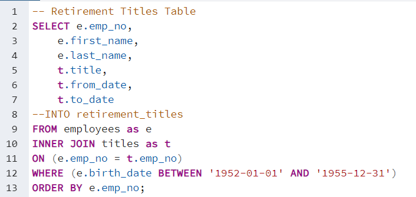
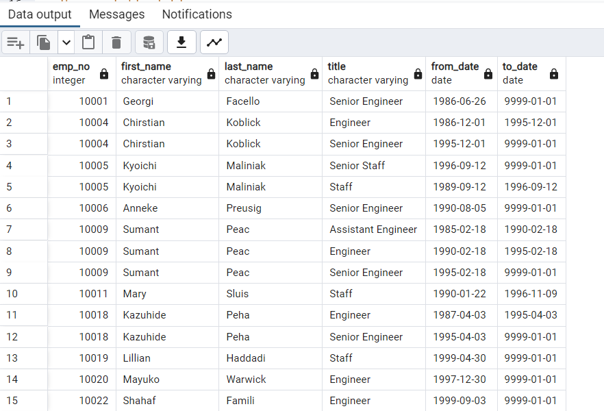
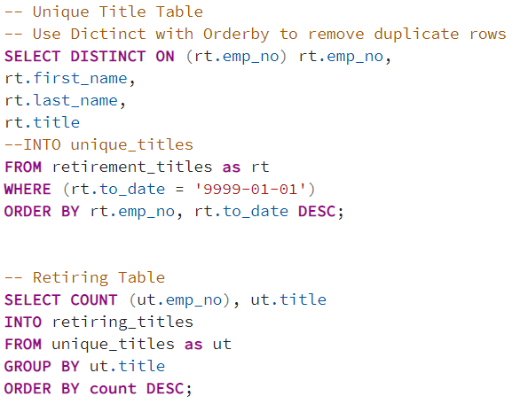

# Pewlett Hackard Analysis

## Overview

Pewlett Hackard provided us with large data base of employees and they need to determine how many employess are close to retirement. They want to determine how many vacacies will be need to be filled in the comming years. Based on the findings Pewlett Hackard will determine how many employees coul receive a retirement package.

## Results

Based on the following four tables, we obtain the desired information for employees whom might retire soon. 

The table 1 shows employees who where born between years 1952 ans 1955.

Table 2 

Utilizing the DISTINCT ON function we removed the employee names whos names are repited on the table.

Table 3

Shows th amount of employees possibly retiring by department. The ORDER BY fucntion was utilized to display the count column in descending oreder.

