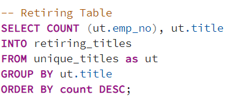
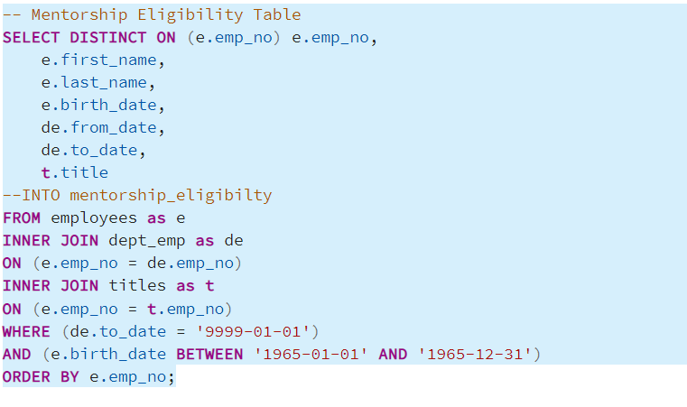
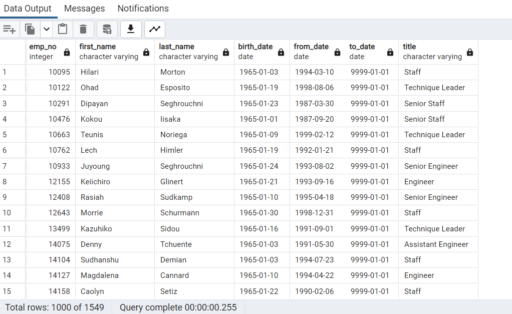
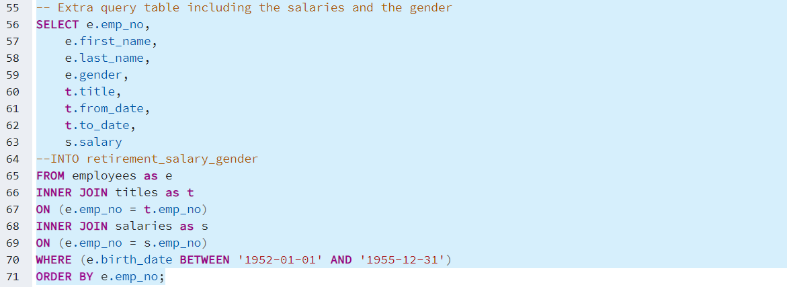
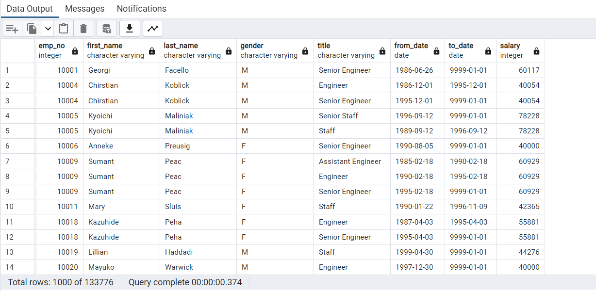

# Pewlett Hackard Analysis

## Overview

Pewlett Hackard provided us with large data base of employees and they need to determine how many employess are close to retirement. They want to determine how many vacacies will be need to be filled in the comming years. Based on the findings Pewlett Hackard will determine how many employees coul receive a retirement package.

## Results

Based on the following four tables, we obtain the desired information for employees whom might retire soon. 

### The table 1 

shows employees who where born between years 1952 ans 1955.

### Table 2 

Utilizing the DISTINCT ON function we removed the employee names whos names are repited on the table.

### Table 3

Shows th amount of employees possibly retiring by department. The ORDER BY fucntion was utilized to display the count column in descending oreder.

### Table 4

indicates employees who are born after 1965, and meet the critery to be in the mentorship program. The DISCTINT ON function was utilized to sort the result of the table

## Summary

The analysis shows that there are a possible of 72,458 employees who will retire. 
  25,916 Senior Engineer
  24,926 Senior Staff
  9,285 Engineer
  7,636 Staff
  3,603 Technique Leader
  1,090 Assistant Engineer
  2 Managers

- How many employees are qualified to be in the mentorship program to train the new generation

  There are 1549 emloyees eligible for the mentoring program.
  
  Additional queries that could determone the outcome of the retiring workforce of Pewlett Hackard
  
  Employees gender and Salary
  
  
  
  
  

